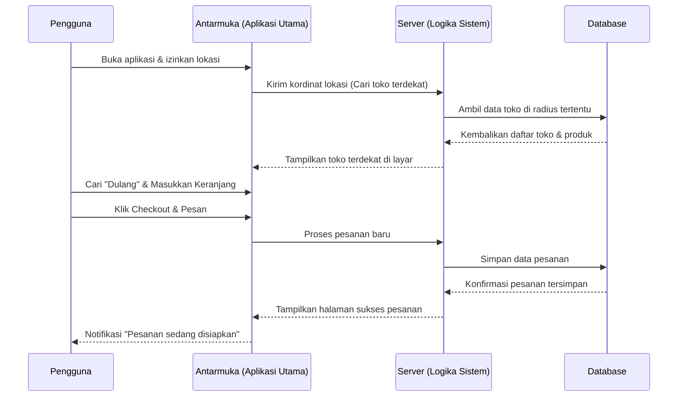
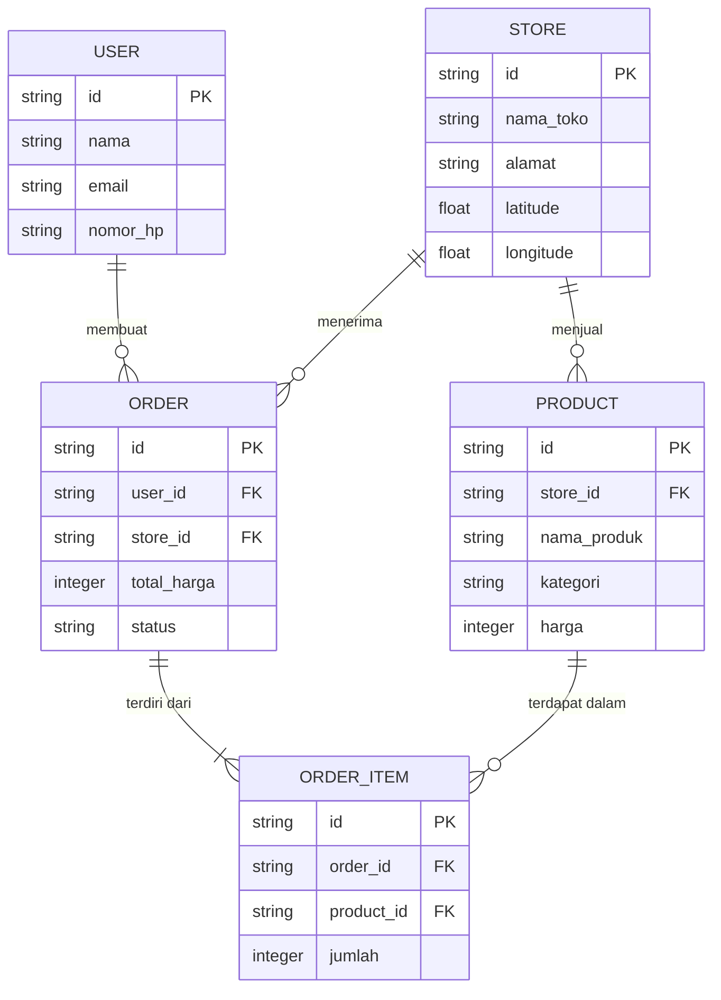

# PRD — Project Requirements Document

## 1. Overview
Banyak umat Hindu, terutama mereka yang bekerja penuh waktu dan memiliki kesibukan tinggi, kesulitan menyisihkan waktu untuk membuat sarana persembahyangan sendiri seperti canang sari atau banten. 

Aplikasi ini hadir sebagai solusi *marketplace* atau platform pemesanan online khusus untuk kebutuhan sembahyang. Aplikasi ini membantu pengguna untuk dengan mudah menemukan toko perlengkapan sembahyang terdekat, mengecek harga secara transparan, dan memesan sesajen atau perlengkapan (seperti dulang, bokor, payung) langsung dari ponsel mereka. Tujuan utama aplikasi ini adalah untuk **menghemat waktu pengguna** dan membuat proses pemenuhan kebutuhan spiritual menjadi **jauh lebih gampang dan praktis**.

## 2. Requirements
- **Berbasis Lokasi (Layanan Geolocation):** Sistem harus bisa mendeteksi lokasi pengguna untuk merekomendasikan toko atau penjual terdekat.
- **Katalog yang Jelas & Transparan:** Harus menyediakan tampilan foto produk, deskripsi singkat, dan harga yang pasti.
- **Sistem Transaksi Sederhana:** Proses dari memilih barang hingga pembayaran harus cepat (beberapa kali klik saja).
- **Aksesibilitas Mobile (Responsif):** Karena targetnya adalah orang sibuk, aplikasi harus sangat nyaman digunakan melalui layar *smartphone* (Mobile-first design).

## 3. Core Features
- **Cari Toko Terdekat (Fitur Utama/First Win):** Peta interaktif atau daftar toko yang diurutkan berdasarkan jarak terdekat dari lokasi pengguna saat ini.
- **Pemesanan Sesajen Online:** Fitur keranjang belanja untuk memesan kebutuhan harian (seperti dupa, canang sari, taledan) untuk dikirim langsung ke rumah (sebaiknya mendukung pengiriman instan).
- **Katalog & Pencarian Spesifik:** Fitur pencarian cerdas yang memungkinkan pengguna mencari perlengkapan spesifik (misalnya mengetik "Dulang Kayu" atau "Bokor Kuningan") lengkap dengan harga yang transparan.
- **Kategori Produk Terpisah:** Pemisahan yang jelas antara "Barang Habis Pakai" (sesajen, dupa, bunga) dan "Perlengkapan" (payung, dulang, pakaian adat) agar mudah dinavigasi.

## 4. User Flow
1. **Buka Aplikasi & Izin Lokasi:** Pengguna membuka aplikasi dan memberikan izin akses lokasi.
2. **Lihat Rekomendasi:** Layar beranda langsung menampilkan toko-toko terdekat yang menjual sarana sembahyang.
3. **Cari Barang:** Pengguna menggunakan kolom pencarian untuk mencari perlengkapan (misal: "canang sari harian" atau "dulang").
4. **Cek Harga & Masukkan Keranjang:** Pengguna melihat harga, memastikan barang sesuai, dan menambahkannya ke keranjang.
5. **Checkout & Pengiriman:** Pengguna memilih metode pengiriman (misal: ojek online instan) dan mengonfirmasi pesanan.
6. **Selesai:** Barang diterima, pengguna sangat terbantu karena menghemat waktu.

## 5. Architecture
Aplikasi ini menggunakan arsitektur web modern yang memisahkan antara antarmuka pengguna (Frontend), logika bisnis (Backend), dan penyimpanan data (Database). Saat pengguna mencari toko terdekat, sistem akan mengirimkan lokasi pengguna ke server, yang kemudian mencocokkannya dengan database toko terdekat.

## 6. Database Schema
Untuk menjalankan aplikasi ini, kita membutuhkan beberapa tabel penyimpanan data utama:

1. **User (Pengguna):** Menyimpan data pembeli.
   - `id`: ID unik pengguna (Teks)
   - `nama`: Nama lengkap pengguna (Teks)
   - `email`: Email untuk login (Teks)
   - `nomor_hp`: Nomor telepon untuk pengiriman (Teks)

2. **Store (Toko):** Menyimpan data penjual sesajen/perlengkapan.
   - `id`: ID unik toko (Teks)
   - `nama_toko`: Nama toko (Teks)
   - `alamat`: Alamat lengkap (Teks)
   - `latitude` & `longitude`: Titik kordinat peta untuk fitur pencarian terdekat (Angka/Decimal)

3. **Product (Barang):** Menyimpan daftar canang, dulang, dll.
   - `id`: ID unik produk (Teks)
   - `store_id`: ID toko penjual produk ini (Teks)
   - `nama_produk`: Nama barang (Teks)
   - `kategori`: Sesajen atau Perlengkapan (Teks)
   - `harga`: Harga jual (Angka)

4. **Order (Pesanan):** Menyimpan transaksi pengguna.
   - `id`: ID unik pesanan (Teks)
   - `user_id`: ID pembeli (Teks)
   - `store_id`: ID toko tempat membeli (Teks)
   - `total_harga`: Total pembayaran (Angka)
   - `status`: Status pesanan seperti "Menunggu", "Diproses", "Dikirim" (Teks)

5. **OrderItem (Detail Pesanan):** Menyimpan rincian barang apa saja dalam satu pesanan.
   - `id`: ID detail (Teks)
   - `order_id`: Merujuk ke ID pesanan utama (Teks)
   - `product_id`: Merujuk ke barang yang dibeli (Teks)
   - `jumlah`: Kuantitas barang yang dibeli (Angka)

## 7. Tech Stack
Mengingat aplikasi ini dirancang dari awal dan membutuhkan performa tinggi serta kemudahan pengembangan, rekomendasi teknologi yang digunakan adalah:

- **Frontend & Backend (Fullstack Framework):** Next.js (Mendukung pembuatan aplikasi yang cepat, responsif, dan performa tinggi secara keseluruhan).
- **Tampilan (User Interface):** Tailwind CSS dipadukan dengan shadcn/ui (Membuat desain visual yang modern, rapi, dan gampang digunakan di HP).
- **Database Utama:** SQLite (Ringan dan performa bagus untuk fase awal pengembangan).
- **Sistem Pengelola Database (ORM):** Drizzle ORM (Menjaga struktur data agar rapi dan aman).
- **Sistem Akun (Autentikasi):** Better Auth (Untuk sistem login yang cepat dan aman).
- **Integrasi Tambahan:** Google Maps API atau Mapbox (Sangat diwajibkan untuk menjalankan fitur utama: Mencari toko terdekat berdasarkan radius lokasi).